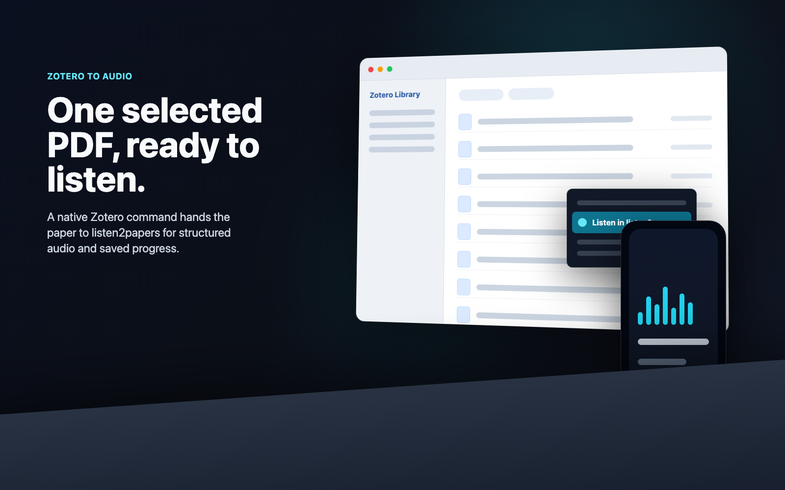

# listen2papers for Zotero

Send selected Zotero PDFs to listen2papers from inside Zotero Desktop.

This plugin adds a `Listen in listen2papers` command to Zotero's item context
menu. It uploads one selected local PDF attachment to your listen2papers account
and opens the created document in the listen2papers web reader.



## Install

1. Download `listen2papers-zotero.xpi` from the latest GitHub release or from
   `https://listen2papers.com/zotero/listen2papers-zotero.xpi`.
2. In Zotero Desktop, open `Tools -> Plugins`.
3. Choose `Install Plugin From File...` from the gear menu and select the XPI.
4. Restart Zotero if prompted.
5. In listen2papers, open `Settings` and generate a Zotero desktop plugin token.
6. In Zotero, set these preferences:
   - `extensions.listen2papers.apiBaseUrl` to `https://listen2papers.com`
   - `extensions.listen2papers.token` to your plugin token
   - `extensions.listen2papers.autoGenerateAudio` to `true` or `false`

## Use

1. Select one Zotero item with a local PDF attachment.
2. Right-click the item.
3. Choose `Listen in listen2papers`.
4. The plugin uploads the PDF and opens the listen2papers reader.

## Compatibility

- Zotero `7.0` through `9.0.*`
- macOS, Windows, and Linux should work where Zotero supports bootstrapped
  plugins, but the initial release has been smoke-tested most heavily on macOS.

Runtime evidence before the public `v0.1.0` release:

- Zotero 7.0.30 source-proxy headless startup smoke.
- Zotero 8.0.5 packed-XPI headless startup smoke.
- Zotero 9.0.4 packed-XPI headless and GUI upload smoke.

## Privacy And Security

Zotero plugins run with local desktop privileges. Only install XPI files from
trusted release channels.

This plugin reads the selected local PDF attachment and sends it to
`https://listen2papers.com` with Zotero metadata such as title, DOI, URL,
library id, item key, attachment key, and authors when available. Authentication
uses a scoped bearer token created in listen2papers Settings. The server stores
only a hash of that token, and you can revoke the token from Settings.

## Updates

The XPI manifest points Zotero to:

`https://listen2papers.com/zotero/updates.json`

That manifest advertises the latest hosted release and SHA-256 hash.

## Build

```sh
npm run package
```

The package script writes:

- `dist/listen2papers-zotero.xpi`
- `dist/updates.json`
- `dist/SHA256SUMS.txt`

## Support

Use the listen2papers support link on the website or open a GitHub issue with:

- Zotero version
- operating system
- plugin version
- whether the selected Zotero item has a local PDF attachment
- any visible Zotero alert text

## License

No open-source license is declared yet. The source is published for release
transparency and user inspection.
